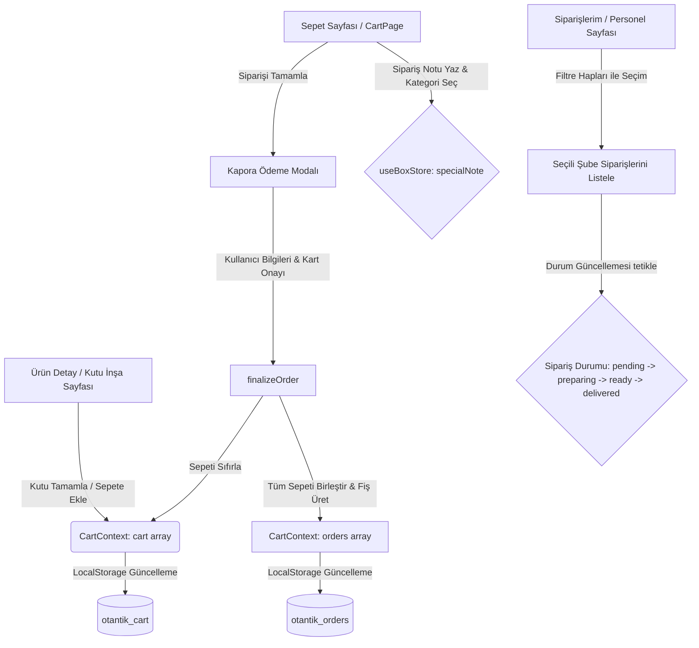

# 🛒 Otantik Fırın - Sepet ve Siparişlerim Sistemi Kılavuzu (V2.0)

Bu kılavuz, **Otantik Fırın** uygulamasının alışveriş sepeti ve sipariş takip sistemlerinin nasıl çalıştığını hem **görsel (UI/UX)** hem de **kod mimarisi (State Management)** açısından detaylı bir şekilde açıklar.

---

## 🗺️ 1. Genel Mimari ve Veri Akış Şeması

Uygulamadaki sepet ve sipariş akışı, **React Context** (`CartContext.jsx`), **Zustand Store** (`useBoxStore.js`) ve **Tarayıcı Depolaması** (`LocalStorage`) üzerinde senkronize olarak çalışır.

### 🔄 Veri Akışı ve Durum Yönetimi Şeması


---

## 🛒 2. Sepet Sistemi (`CartPage.jsx`) ve Görsel Tasarımı

Sepet sayfası, premium bir pastane hissini yansıtacak şekilde **Antrasit (`#0D0D0D`)** ve **Altın Sarısı (`#D4AF37`)** tonlarında, **Glassmorphism** (cam efekti) temasıyla tasarlanmıştır.

### 🧱 Görsel Arayüz Yapısı (Visual Layout)

```
┌────────────────────────────────────────────────────────────┐
│ ◄ Sepetim (H1 - Cormorant Garamond Serif Font, Beyaz)      │
│                                                            │
│ ┌────────────────────────────────────────────────────────┐ │
│ │ 🍞 Karışık Kuru Pasta Seçkisi (500gr)     [ X (Sil) ]  │ │  ◄ Cam Kartlar (glass)
│ │    180.00 ₺                                            │ │    %3 Şeffaf Beyaz Arka Plan
│ └────────────────────────────────────────────────────────┘ │    Blurlu Backdrop
│ ┌────────────────────────────────────────────────────────┐ │
│ │ 🍰 Otantik Frambuazlı Yaş Pasta (Mini)   [ X (Sil) ]  │ │
│ │    420.00 ₺                                            │ │
│ └────────────────────────────────────────────────────────┘ │
│                                                            │
│ 💬 Özel İstek & Notunuz                                     │
│ ┌───────────────┐ ┌───────────────┐ ┌───────────────┐      │
│ │    Arayın     │ │  Değiştirin   │ │  Özel İstek   │      │ ◄ Not Kategori Seçicileri
│ └───────────────┘ └───────────────┘ └───────────────┘      │
│ ┌────────────────────────────────────────────────────────┐ │
│ │ Not alanı (Örnek: Lütfen frambuazlar taze olsun...)   │ │ ◄ Koyu Şeffaf Textarea
│ └────────────────────────────────────────────────────────┘ │
│                                                            │
│ ┌────────────────────────────────────────────────────────┐ │
│ │ 💰 Toplam: 600.00 ₺                                     │ │ ◄ Sabitlenmiş Alt Bar
│ │ 🛒 SİPARİŞİ TAMAMLA   [►]                               │ │   (glass-gold)
│ └────────────────────────────────────────────────────────┘ │
└────────────────────────────────────────────────────────────┘
```

### 💡 Sepet Fonksiyonları ve Mantığı:
1. **Ürün Kartları (`Layout & motion.div`):** Her sepet elemanı `glass` sınıfına sahip bir kart içinde listelenir. Ürün görseli (Emoji veya Resim), isim, fiyat bilgisi bulunur. Kırmızı renkli `Trash2` çöp kutusu ikonu ile ürünü sepetten kaldırmak mümkündür (`removeFromCart`).
2. **Özel Not Yönetimi (`Zustand & textarea`):** `useBoxStore` içindeki `specialNote` ve `noteCategory` durumları kontrol edilir.
   - Üç hızlı kategori butonu vardır: **"Arayın"**, **"Değiştirin"**, **"Özel İstek"**. Seçili olan buton `var(--gold)` arka planı ve koyu font ile parlar.
   - Textarea içindeki her harf değişikliği anlık olarak globale kaydedilerek tarayıcı kapansa bile korunur.
3. **Sabit Takip Eden Toplam Barı (`fixed footer glass-gold`):** Ekranın en altında sabitlenen bu premium bar, toplam fiyatı ve **"SİPARİŞİ TAMAMLA"** butonunu taşır.

---

## 💳 3. Kapora Ödeme Modülü (Checkout Modal)

Özel butik üretim mantığıyla çalışan Otantik Fırın, sipariş iptallerini önlemek adına **%30 Kapora (Ön Ödeme)** simülasyonu uygular.

### 📱 Kapora Formu ve Çalışma Mantığı
Kullanıcı "Siparişi Tamamla" butonuna bastığında ekranı kaplayan koyu bir modal açılır:

*   **Müşteri Alıcı Bilgileri:**
    *   **Teslim Alacak Kişi Adı:** `recipientName` state'inde tutulur (Zorunlu alan).
    *   **Telefon Numarası:** `recipientPhone` state'inde tutulur (Zorunlu alan).
*   **Altın Sarısı Kapora Bilgi Kutusu (`glass-gold`):**
    *   **Simüle Edilen Formül:**
        $$\text{Kapora (Şimdi Ödenecek)} = \text{Toplam Tutar} \times 0.30$$
        $$\text{Şubede Ödenecek Kalan Bakiye} = \text{Toplam Tutar} - \text{Kapora}$$
    *   Müşteriye bu dağılım net bir listeyle gösterilir.
*   **Kart Bilgileri Simülasyonu:**
    *   16 haneli Kart Numarası, AY/YIL son kullanma tarihi ve 3 haneli CVV giriş alanları. (Sadece numerik girişleri kabul eden regex filtreleri barındırır).
*   **Onay Butonu:** **"KAPORAYI ÖDE VE SİPARİŞİ ONAYLA (XYZ TL)"** butonu tetiklendiğinde ödeme başarıyla simüle edilir, sipariş personelin göreceği Sipariş listesine yazılır ve fırın fişi gösterilir.

---

## 📋 4. Sipariş Takip Paneli (`OrdersPage.jsx`)

Müşterinin veya şube personelinin sipariş durumunu yönettiği kısımdır. Durum çubukları ve gelişmiş filtre modülleri barındırır. Şube izolasyonu özelliği sayesinde, sadece aktif seçilmiş olan şubenin siparişlerini gösterir.

### 🎨 Sipariş Kartı ve Durum Glow (Işıltı) Tasarımı
Siparişlerin güncel durumuna göre kartların etrafındaki çerçeve renkleri ve durum etiketleri dinamik olarak değişir:

| Durum (Status) | Etiket | Renk Kodu | Arayüz Temsili Görsel Efekti |
| :--- | :--- | :--- | :--- |
| **Pending** | Bekliyor | `#64B5F6` (Mavi) | Kart etrafında hafif mavi bir sis parlaması (`glow`) |
| **Preparing** | Hazırlanıyor | `#FFB74D` (Turuncu)| Kart etrafında sıcak fırın ateşini andıran turuncu glow |
| **Ready** | Hazır | `#81C784` (Yeşil) | Kart etrafında teslimata hazır olduğunu gösteren yeşil glow |
| **Delivered** | Teslim Edildi | `#CE93D8` (Mor) | Kart etrafında pasif/tamamlanmış sakin mor glow |

### 🛠️ Personel Kontrolleri ve İşlevsel Butonlar
Her sipariş kartının altında personelin siparişi hızla yönetmesini sağlayan araçlar bulunur:

1.  **Dinamik Durum İlerletme Butonu:** Sipariş durumuna göre tek tıkla durum değiştirir:
    *   *Bekliyor* ise: `[HAZIRLANIYOR OLARAK İŞARETLE]` butonu belirir.
    *   *Hazırlanıyor* ise: `[HAZIR OLARAK İŞARETLE]` butonu belirir.
    *   *Hazır* ise: `[TESLİM EDİLDİ OLARAK İŞARETLE]` butonu belirir.
2.  **Hızlı Sipariş Fişi (`FİŞ`):** Fiziksel slip modalını açar.
3.  **Kopyala İkonu:** Fiş içeriğini panoya kopyalar (`Copy`).
4.  **WhatsApp İkonu (`MessageCircle`):** Sipariş fişi detayını tek tıkla WhatsApp üzerinden şube usta grubuna veya müşteriye göndermek için `wa.me/?text=` linkini otomatik hazırlar.
5.  **Detayları Aç/Kapat (Accordion Panel):** Tıklandığında siparişe ait alt ürünlerin detayları (Kek tabanı, krema dolgusu, alerjen notları, pasta üstü yazıları, ikram mumlar ve ekstralar) aşağı doğru kayarak açılır.
6.  **Geliştirici JSON Konsolu (`Code2`):** Personelin veya teknik ekibin sipariş şemasını API formatında incelemesini sağlayan, açılır-kapanır kod konsolu.

---

## 🧾 5. Personel Sipariş Fişi Modalı (`OrderSlipModal.jsx`)

Bu modül, şube içindeki mutfakta ya da tezgahta fiziki fiş yazıcılarından (termal printer) alınan çıktı görünümüyle tasarlanmıştır.

### 🔴 Operasyonel Kırmızı Barkod / Usta Dikkat Etiketi
Müşterinin sipariş verirken eklediği özel istek notları (`specialNote`), usta hatalarını (örneğin alerji durumu olan veya acil teslimat istenen siparişlerde) sıfıra indirmek için **fişin en üstünde devasa bir kırmızı blok** içinde gösterilir:

*   **Tasarım:** Kalın kırmızı bir arka plan, kalın bordo dış çerçeve ve ünlem işareti ile birlikte **büyük, kalın harflerle usta notu** yer alır.
*   Bu yapı personelin fişi eline aldığı an müşterinin özel talebini görmesini garanti eder.

### 🗒️ Termal Fiş Görsel Yapısı
*   **Font:** Monospace Courier New (Yazıcı formatı).
*   **Tasarım:** Üstte **"OTANTİK Artizan Fırın & Pastane"** logosu, dash-line kesikli çizgiler (`------------------`), rastgele üretilen slip numarası ve siparişin detaylı dökümü.

---

## 🏗️ 6. Kod Mimarisindeki Temel Metotlar ve Görevleri

Sistemlerin çalışmasını sağlayan arka plan kod bileşenleri şöyledir:

### A. `CartContext.jsx` Metotları
*   `confirmBox(boxData)`: Zustand store'dan gelen özel kutu seçimlerini paketler. Hedef ağırlığına göre fiyatı belirler (500g için 180 TL, 1kg için 340 TL şeklinde), WhatsApp slip formatını üretir ve sepete ekler.
*   `finalizeOrder(specialNote, noteCategory, branch)`: Sepetteki tüm ürünleri (Özel kutuları ve tekil ürünleri) birleştirir. Eşsiz bir Sipariş ID (`ord-xxxx`) üretir. Seçilen şubeyi, teslimat tarihini ve tüm ekstraları kapsayan **Master Sipariş Slip metnini** üretir. Veriyi `orders` state'ine ekleyip sepeti boşaltır.
*   `generateWhatsAppSlip(box)`: Sadece özel kutunun içindeki kuru pastaları veya petifürleri adetlerine göre gruplayarak usta fişi metnine dönüştürür.

### B. `useBoxStore.js` Metotları (Zustand)
*   `addItem(boxKey, product)`: Kutuya gramaj limitine sadık kalarak el yapımı kuru pasta ekler.
*   `fillRemaining(preference)`: Kalan gramajı "En Çok Satanlar", "Tatlı Ağırlıklı" veya "Tuzlu Ağırlıklı" algoritmalarıyla otomatik doldurur.
*   `isOrderValid()`: Kutunun doluluk oranının sipariş edilebilir alt limitte (`warning` sınırında) olup olmadığını denetler.

---

> [!NOTE]
> **Sapma Limitleri:** Tüm kuru pasta ve petifür siparişleri el yapımı sanatsal üretim olduğu için fişlerde her zaman **"+/- %15 Gramaj Sapma Uyarısı"** otomatik olarak eklenmektedir. Bu, hukuki ve operasyonel güvenliği sağlar.

> [!TIP]
> **Şube Entegrasyonu:** Siparişlerin kaybolmaması için tarayıcının `localStorage` nesnesinde anlık olarak `otantik_cart` ve `otantik_orders` anahtarları altında yedekleme yapılır. Sayfa yenilense veya tarayıcı kapansa dahi veriler güvendedir.
